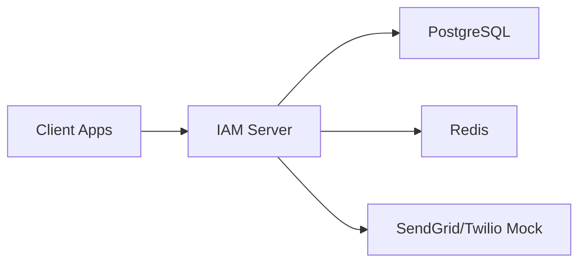

# IAM Server

A Java 17 + Spring Boot 3 Identity and Access Management server built around Spring Authorization Server, Spring Security 6, PostgreSQL, Redis, JWT, RBAC, and MFA.

## Overview

This project acts as a central Identity Provider for internal applications and supports:

- User registration and login
- OAuth 2.0 Authorization Code flow
- Client Credentials flow
- OIDC discovery and userinfo
- JWT access tokens and refresh tokens
- RBAC with roles and authorities
- MFA via TOTP and OTP
- Password reset
- Redis-backed rate limiting and temporary state
- Audit logging
- Docker deployment

## Features

- OAuth 2.0 authorization server
- OIDC discovery endpoints
- JWT with RSA signing
- BCrypt password storage
- Role-based access control
- MFA with TOTP and OTP
- Redis-based rate limiting and revocation storage
- PostgreSQL-backed persistence
- Docker Compose setup
- OpenAPI docs via Springdoc

## Architecture



## Technology Stack

- Java 17
- Spring Boot 3.3.x
- Spring Security 6
- Spring Authorization Server
- PostgreSQL
- Redis
- Maven
- Docker Compose
- Thymeleaf
- Springdoc OpenAPI

## Project Structure

```text
iam-server/
├── pom.xml
├── docker-compose.yml
├── Dockerfile
├── README.md
├── SECURITY.md
├── .env.example
├── src/
│   ├── main/
│   │   ├── java/com/example/iam
│   │   └── resources/
│   │       ├── application.yml
│   │       ├── application-dev.yml
│   │       ├── application-prod.yml
│   │       ├── schema.sql
│   │       └── templates/
│   └── test/
└── target/
```

## Prerequisites

- Java 17+
- Maven 3.9+
- Docker Desktop
- PostgreSQL and Redis (or Docker Compose)

## Environment Configuration

Create a `.env` file based on `.env.example` and update variables as needed.

## Running with Docker Compose

This project supports the full three-service stack in Docker Compose:

- PostgreSQL
- Redis
- IAM server

```powershell
docker compose up --build -d
```

The app uses these environment variables automatically:

```env
DB_URL=jdbc:postgresql://postgres:5432/iam_db
DB_USERNAME=iam_user
DB_PASSWORD=iam_password
REDIS_HOST=redis
REDIS_PORT=6379
SPRING_PROFILES_ACTIVE=docker
```

## Running against an external PostgreSQL or Redis instance

Set the environment variables before starting Spring Boot:

```powershell
$env:DB_URL="jdbc:postgresql://your-db-host:5432/iam_db"
$env:DB_USERNAME="iam_user"
$env:DB_PASSWORD="iam_password"
$env:REDIS_HOST="your-redis-host"
$env:REDIS_PORT="6379"
$env:SPRING_PROFILES_ACTIVE="prod"
mvn spring-boot:run
```

For a local fallback-only run without Docker or external services:

```powershell
mvn spring-boot:run -Dspring-boot.run.profiles=local
```

## Seed Users

Development credentials are included:

- admin / Admin@12345
- user / User@12345

These are for local demonstration only.

## OAuth Flow

1. Browser navigates to `/oauth2/authorize`
2. User logs in
3. MFA steps if enabled
4. Consent page is shown
5. Authorization code is issued
6. Client exchanges code for tokens at `/oauth2/token`

## OIDC

- Discovery: `/.well-known/openid-configuration`
- JWKs: `/oauth2/jwks`
- User Info: `/userinfo`

## MFA

- TOTP endpoints under `/api/mfa/totp/**`
- OTP endpoints under `/api/mfa/**`
- Development OTP values are printed to console

## JWT

JWT tokens are signed with an RSA keypair generated locally and exposed through the JWKS endpoint.

## RBAC

Roles and authorities are seeded on startup. Example roles:

- ROLE_USER
- ROLE_MANAGER
- ROLE_ADMIN
- ROLE_SERVICE

## Token Revocation

Admin endpoint:

```http
POST /api/admin/tokens/revoke
```

Payload:

```json
{
  "username": "john"
}
```

## Rate Limiting

Redis-backed rate limits protect sensitive endpoints such as login and OTP verification.

## Audit Logging

Audit records are stored in PostgreSQL and available from:

```http
GET /api/admin/audit-logs
```

## API Documentation

OpenAPI docs are available at:

```text
http://localhost:8080/swagger-ui.html
```

## Postman

A Postman collection is not generated automatically here; the API structure mirrors typical OAuth and IAM endpoints.

## Security Considerations

- BCrypt password hashing
- JWT validation via RSA keys
- admin-only administration endpoints
- Redis-based throttling
- MFA enforcement for sensitive flows
- no plaintext password storage

## Production Considerations

- Use a real TLS terminator such as Nginx or a load balancer
- Store keys securely outside the repo
- Use managed PostgreSQL and Redis
- Configure real email/SMS delivery providers
- Restrict admin access

## Demo Commands

```powershell
mvn clean install
mvn spring-boot:run
curl http://localhost:8080/actuator/health
```
